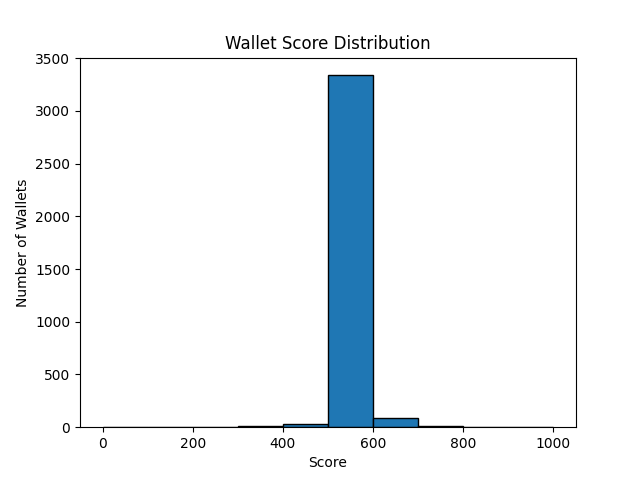

# Analysis of Wallet Credit Scores

## Score Distribution

*(Insert histogram plot here)*

## Observations

- **Low scores (0-200):** Typically wallets with frequent liquidations, low repayments, or bot-like activity.
- **High scores (800-1000):** Consistent repayments, few/no liquidations, regular deposits.

## Behavioral Patterns

- **Low-score wallets:** [Describe patterns, e.g., high borrow/liquidation, no repayments]
- **High-score wallets:** [Describe patterns, e.g., high repay/deposit ratio, no liquidations]

## Score Distribution

